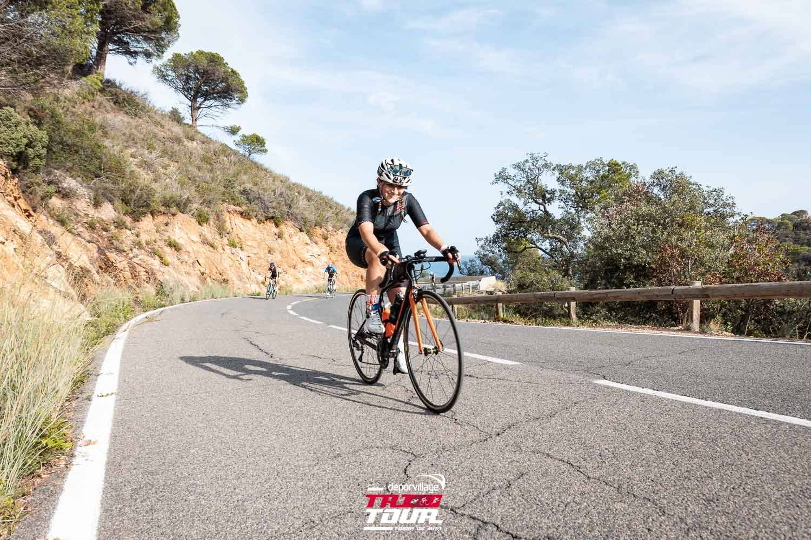

I am a recently graduated PhD researcher, with a dissertation in **fetal brain analysis using FEM modeling and deep learning algorithms** at the **Pompeu Fabra University**. I was part of the [BCN MedTech](https://www.upf.edu/web/bcn-medtech/) group and my PhD thesis was supervised by [Oscar Camara](https://www.upf.edu/web/etic/faculty/-/asset_publisher/vto8LcELdA46/content/camara-rey-oscar/maximized). I hold a degree in Physics from the **University of Barcelona** and a Master in Biomedical Engineering from the **University of Barcelona** and **Polytechnic University of Catalonia**. 

I spend most of my free time doing **[sports](https://www.strava.com/athletes/25797820)**, mainly mid-distance triathlon and sprint duathlon. I also love being surrounded by nature, I enjoy going to the **mountains** and just staring at natural landscapes. 

