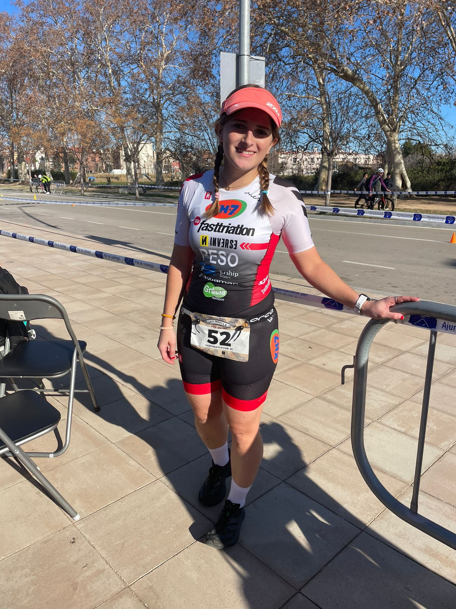
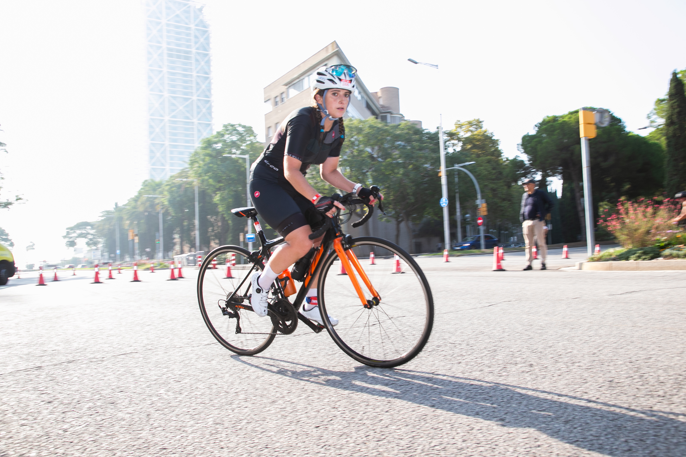
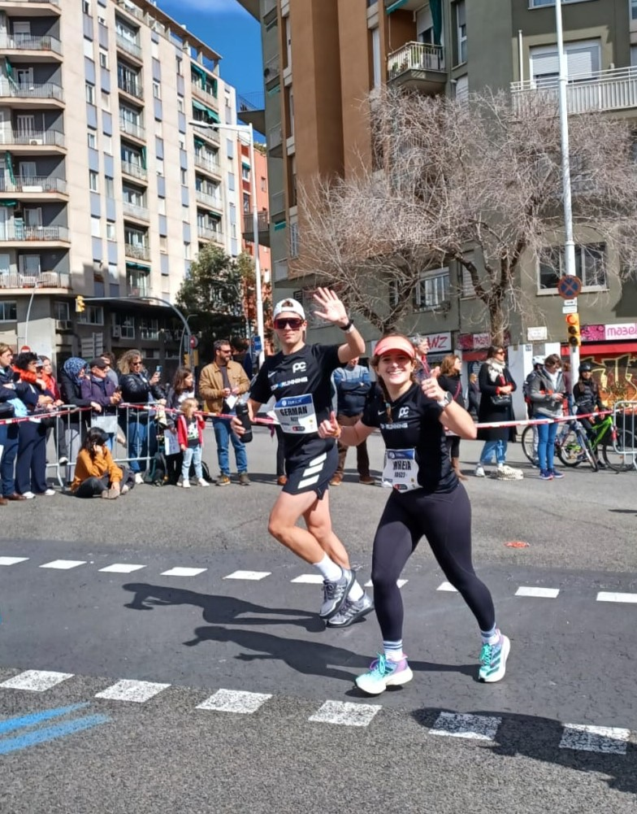

I am a recently graduated PhD researcher, with a dissertation in **fetal brain analysis using FEM modeling and deep learning algorithms** at the **Pompeu Fabra University**. I was part of the [BCN MedTech](https://www.upf.edu/web/bcn-medtech/) group and my PhD thesis was supervised by [Oscar Camara](https://www.upf.edu/web/etic/faculty/-/asset_publisher/vto8LcELdA46/content/camara-rey-oscar/maximized). I obtained the **International Mention** of the phD, after doing a research stay in the Auckland Bioengineering Institute (ABI), Auckland, New Zealand. I was there collaborating with Gonzalo Maso-Talou, from December 2022 until April 2023.

I hold a Bachelor's degree in Physics from the **University of Barcelona** (2012-2016) and a Master's degree in Biomedical Engineering from the **University of Barcelona** and **Polytechnic University of Catalonia** (2016-2018), awarded with the **Extraordinary Master's Award**. 

I spend most of my free time doing **[sports](https://www.strava.com/athletes/25797820)**, mainly sprint duathlon (_left photo_) and mid-distance triathlon (_photo in the middle_). Additionally, I have participated in several half marathons and completed two full marathons (_photo on the right from BCN Marathon 2024_). 
I also love being surrounded by nature, I enjoy going to the **mountains** and just staring at natural landscapes. 

